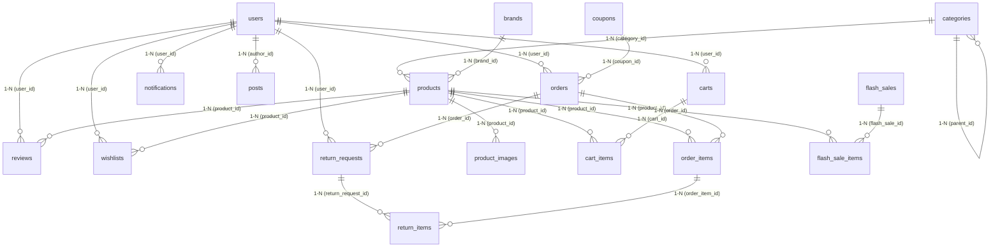

# Đặc tả Hệ thống Cơ sở dữ liệu ERD V2 – 19 bảng chính thức

Tài liệu này đặc tả chi tiết 19 bảng cơ sở dữ liệu chính thức của hệ thống TechPilot phục vụ đầy đủ tất cả các nghiệp vụ của khách hàng và quản trị viên.

---

## Sơ đồ quan hệ thực thể (ERD Diagram - Mermaid)

---

## Đặc tả các Bảng dữ liệu

### 1. users (Người dùng)
Lưu trữ tài khoản của khách hàng và admin:
- `id` INT UNSIGNED AUTO_INCREMENT PRIMARY KEY
- `full_name` VARCHAR(150) NOT NULL
- `email` VARCHAR(150) NOT NULL UNIQUE
- `phone` VARCHAR(50) DEFAULT NULL
- `password` VARCHAR(255) NOT NULL
- `role` ENUM('admin', 'customer') NOT NULL DEFAULT 'customer'
- `address` TEXT DEFAULT NULL
- `status` ENUM('active', 'inactive') NOT NULL DEFAULT 'active'
- `created_at` TIMESTAMP DEFAULT CURRENT_TIMESTAMP
- `updated_at` TIMESTAMP DEFAULT CURRENT_TIMESTAMP ON UPDATE CURRENT_TIMESTAMP

### 2. categories (Danh mục sản phẩm)
Phân loại sản phẩm trong catalog (hỗ trợ phân cấp cha-con):
- `id` INT UNSIGNED AUTO_INCREMENT PRIMARY KEY
- `parent_id` INT UNSIGNED DEFAULT NULL (FK `categories(id)` ON DELETE SET NULL)
- `name` VARCHAR(100) NOT NULL
- `slug` VARCHAR(100) NOT NULL UNIQUE
- `icon` VARCHAR(100) DEFAULT NULL
- `image` VARCHAR(255) DEFAULT NULL
- `description` TEXT DEFAULT NULL
- `status` ENUM('active', 'inactive') NOT NULL DEFAULT 'active'
- `sort_order` INT NOT NULL DEFAULT 0
- `created_at` TIMESTAMP DEFAULT CURRENT_TIMESTAMP
- `updated_at` TIMESTAMP DEFAULT CURRENT_TIMESTAMP ON UPDATE CURRENT_TIMESTAMP

### 3. brands (Thương hiệu)
Nhà sản xuất/Thương hiệu sản phẩm:
- `id` INT UNSIGNED AUTO_INCREMENT PRIMARY KEY
- `name` VARCHAR(100) NOT NULL
- `slug` VARCHAR(100) NOT NULL UNIQUE
- `logo` VARCHAR(255) DEFAULT NULL
- `description` TEXT DEFAULT NULL
- `status` ENUM('active', 'inactive') NOT NULL DEFAULT 'active'
- `created_at` TIMESTAMP DEFAULT CURRENT_TIMESTAMP
- `updated_at` TIMESTAMP DEFAULT CURRENT_TIMESTAMP ON UPDATE CURRENT_TIMESTAMP

### 4. products (Sản phẩm)
Thực thể sản phẩm cốt lõi lưu trữ giá cả và tồn kho:
- `id` INT UNSIGNED AUTO_INCREMENT PRIMARY KEY
- `category_id` INT UNSIGNED DEFAULT NULL (FK `categories(id)` ON DELETE SET NULL)
- `brand_id` INT UNSIGNED DEFAULT NULL (FK `brands(id)` ON DELETE SET NULL)
- `name` VARCHAR(255) NOT NULL
- `slug` VARCHAR(255) NOT NULL UNIQUE
- `short_desc` VARCHAR(500) DEFAULT NULL
- `description` TEXT DEFAULT NULL
- `price` DECIMAL(12, 0) NOT NULL (Giá gốc)
- `old_price` DECIMAL(12, 0) DEFAULT NULL (Giá cũ trước khi giảm)
- `sale_price` DECIMAL(12, 0) DEFAULT NULL (Giá khuyến mãi thông thường)
- `discount_percent` INT DEFAULT 0
- `image` VARCHAR(255) DEFAULT NULL
- `rating` DECIMAL(2, 1) DEFAULT 5.0
- `review_count` INT DEFAULT 0
- `stock` INT DEFAULT 100 (Tồn kho sản phẩm)
- `specs` JSON DEFAULT NULL (Thông số kỹ thuật linh hoạt)
- `is_flash_sale` TINYINT(1) DEFAULT 0
- `is_best_seller` TINYINT(1) DEFAULT 0
- `is_new_arrival` TINYINT(1) DEFAULT 0
- `is_ai_recommend` TINYINT(1) DEFAULT 0
- `status` ENUM('draft', 'active', 'inactive') NOT NULL DEFAULT 'active'
- `created_at` TIMESTAMP DEFAULT CURRENT_TIMESTAMP
- `updated_at` TIMESTAMP DEFAULT CURRENT_TIMESTAMP ON UPDATE CURRENT_TIMESTAMP

### 5. product_images (Thư viện ảnh sản phẩm)
- `id` INT UNSIGNED AUTO_INCREMENT PRIMARY KEY
- `product_id` INT UNSIGNED NOT NULL (FK `products(id)` ON DELETE CASCADE)
- `image_url` VARCHAR(255) NOT NULL
- `alt_text` VARCHAR(255) DEFAULT NULL
- `position` INT NOT NULL DEFAULT 0
- `is_primary` TINYINT(1) NOT NULL DEFAULT 0

### 6. carts (Giỏ hàng)
- `id` BIGINT UNSIGNED AUTO_INCREMENT PRIMARY KEY
- `user_id` INT UNSIGNED DEFAULT NULL (FK `users(id)` ON DELETE CASCADE)
- `guest_token` CHAR(64) DEFAULT NULL UNIQUE
- `status` ENUM('active', 'converted', 'abandoned') NOT NULL DEFAULT 'active'
- `expires_at` DATETIME DEFAULT NULL
- `created_at` TIMESTAMP DEFAULT CURRENT_TIMESTAMP
- `updated_at` TIMESTAMP DEFAULT CURRENT_TIMESTAMP ON UPDATE CURRENT_TIMESTAMP

### 7. cart_items (Chi tiết giỏ hàng)
- `id` BIGINT UNSIGNED AUTO_INCREMENT PRIMARY KEY
- `cart_id` BIGINT UNSIGNED NOT NULL (FK `carts(id)` ON DELETE CASCADE)
- `product_id` INT UNSIGNED NOT NULL (FK `products(id)` ON DELETE CASCADE)
- `quantity` INT NOT NULL DEFAULT 1
- `created_at` TIMESTAMP DEFAULT CURRENT_TIMESTAMP
- `updated_at` TIMESTAMP DEFAULT CURRENT_TIMESTAMP ON UPDATE CURRENT_TIMESTAMP
- UNIQUE KEY `uq_cart_product` (`cart_id`, `product_id`)

### 8. coupons (Mã giảm giá)
- `id` INT UNSIGNED AUTO_INCREMENT PRIMARY KEY
- `code` VARCHAR(50) NOT NULL UNIQUE
- `discount_value` DECIMAL(12, 0) NOT NULL
- `type` ENUM('fixed', 'percent', 'free_shipping') NOT NULL DEFAULT 'fixed'
- `max_discount` DECIMAL(12, 0) DEFAULT NULL
- `min_order_value` DECIMAL(12, 0) DEFAULT 0
- `usage_limit` INT DEFAULT NULL
- `usage_limit_per_user` INT DEFAULT 1
- `used_count` INT NOT NULL DEFAULT 0
- `start_date` DATETIME DEFAULT NULL
- `end_date` DATETIME DEFAULT NULL
- `description` VARCHAR(500) DEFAULT NULL
- `status` ENUM('active', 'inactive') NOT NULL DEFAULT 'active'
- `created_at` TIMESTAMP DEFAULT CURRENT_TIMESTAMP
- `updated_at` TIMESTAMP DEFAULT CURRENT_TIMESTAMP ON UPDATE CURRENT_TIMESTAMP

### 9. orders (Đơn hàng)
- `id` BIGINT UNSIGNED AUTO_INCREMENT PRIMARY KEY
- `order_code` VARCHAR(50) NOT NULL UNIQUE
- `user_id` INT UNSIGNED DEFAULT NULL (FK `users(id)` ON DELETE SET NULL)
- `coupon_id` INT UNSIGNED DEFAULT NULL (FK `coupons(id)` ON DELETE SET NULL)
- `customer_name` VARCHAR(150) NOT NULL
- `phone` VARCHAR(50) NOT NULL
- `email` VARCHAR(150) DEFAULT NULL
- `address` TEXT NOT NULL
- `note` TEXT DEFAULT NULL
- `payment_method` VARCHAR(50) NOT NULL DEFAULT 'COD'
- `payment_status` ENUM('unpaid', 'pending', 'paid', 'failed', 'refunded') NOT NULL DEFAULT 'unpaid'
- `shipping_carrier` VARCHAR(100) DEFAULT NULL
- `shipping_tracking_code` VARCHAR(120) DEFAULT NULL
- `shipping_fee` DECIMAL(12, 0) NOT NULL DEFAULT 0
- `subtotal` DECIMAL(12, 0) NOT NULL DEFAULT 0
- `discount_amount` DECIMAL(12, 0) NOT NULL DEFAULT 0
- `total_amount` DECIMAL(12, 0) NOT NULL DEFAULT 0
- `status` ENUM('pending', 'confirmed', 'processing', 'shipping', 'completed', 'cancelled') NOT NULL DEFAULT 'pending'
- `idempotency_key` CHAR(36) DEFAULT NULL UNIQUE
- `created_at` TIMESTAMP DEFAULT CURRENT_TIMESTAMP
- `updated_at` TIMESTAMP DEFAULT CURRENT_TIMESTAMP ON UPDATE CURRENT_TIMESTAMP

### 10. order_items (Chi tiết đơn hàng)
- `id` BIGINT UNSIGNED AUTO_INCREMENT PRIMARY KEY
- `order_id` BIGINT UNSIGNED NOT NULL (FK `orders(id)` ON DELETE CASCADE)
- `product_id` INT UNSIGNED DEFAULT NULL (FK `products(id)` ON DELETE SET NULL)
- `product_name` VARCHAR(255) NOT NULL
- `price` DECIMAL(12, 0) NOT NULL DEFAULT 0
- `quantity` INT NOT NULL DEFAULT 1
- `line_total` DECIMAL(12, 0) NOT NULL DEFAULT 0
- `created_at` TIMESTAMP DEFAULT CURRENT_TIMESTAMP

### 11. reviews (Đánh giá & Bình luận)
- `id` BIGINT UNSIGNED AUTO_INCREMENT PRIMARY KEY
- `product_id` INT UNSIGNED NOT NULL (FK `products(id)` ON DELETE CASCADE)
- `user_id` INT UNSIGNED DEFAULT NULL (FK `users(id)` ON DELETE SET NULL)
- `reviewer_name` VARCHAR(150) NOT NULL
- `rating` DECIMAL(2, 1) NOT NULL DEFAULT 5.0
- `comment` TEXT DEFAULT NULL
- `status` ENUM('pending', 'published', 'hidden') NOT NULL DEFAULT 'published'
- `created_at` TIMESTAMP DEFAULT CURRENT_TIMESTAMP
- `updated_at` TIMESTAMP DEFAULT CURRENT_TIMESTAMP ON UPDATE CURRENT_TIMESTAMP

### 12. wishlists (Sản phẩm yêu thích)
- `id` BIGINT UNSIGNED AUTO_INCREMENT PRIMARY KEY
- `user_id` INT UNSIGNED NOT NULL (FK `users(id)` ON DELETE CASCADE)
- `product_id` INT UNSIGNED NOT NULL (FK `products(id)` ON DELETE CASCADE)
- `created_at` TIMESTAMP DEFAULT CURRENT_TIMESTAMP
- UNIQUE KEY `uq_user_product` (`user_id`, `product_id`)

### 13. flash_sales (Chiến dịch Flash Sale)
- `id` INT UNSIGNED AUTO_INCREMENT PRIMARY KEY
- `title` VARCHAR(180) NOT NULL
- `slug` VARCHAR(180) NOT NULL UNIQUE
- `start_time` DATETIME NOT NULL
- `end_time` DATETIME NOT NULL
- `status` ENUM('draft', 'active', 'ended', 'cancelled') NOT NULL DEFAULT 'active'
- `created_at` TIMESTAMP DEFAULT CURRENT_TIMESTAMP
- `updated_at` TIMESTAMP DEFAULT CURRENT_TIMESTAMP ON UPDATE CURRENT_TIMESTAMP

### 14. flash_sale_items (Chi tiết sản phẩm Flash Sale)
- `id` INT UNSIGNED AUTO_INCREMENT PRIMARY KEY
- `flash_sale_id` INT UNSIGNED NOT NULL (FK `flash_sales(id)` ON DELETE CASCADE)
- `product_id` INT UNSIGNED NOT NULL (FK `products(id)` ON DELETE CASCADE)
- `discount_price` DECIMAL(15, 2) NOT NULL
- `allocation_quantity` INT NOT NULL DEFAULT 0 (Số lượng mở bán tối đa)
- `sold_quantity` INT NOT NULL DEFAULT 0 (Lượt bán thực tế được cập nhật)
- `limit_per_user` INT NOT NULL DEFAULT 1
- UNIQUE KEY `uq_campaign_product` (`flash_sale_id`, `product_id`)

### 15. banners (Quảng cáo quảng bá)
- `id` INT UNSIGNED AUTO_INCREMENT PRIMARY KEY
- `title` VARCHAR(255) NOT NULL
- `image` VARCHAR(255) NOT NULL
- `link` VARCHAR(255) DEFAULT '#'
- `type` VARCHAR(50) NOT NULL DEFAULT 'hero'
- `position` INT DEFAULT 1
- `status` ENUM('active', 'inactive') NOT NULL DEFAULT 'active'
- `start_at` DATETIME DEFAULT NULL
- `end_at` DATETIME DEFAULT NULL
- `created_at` TIMESTAMP DEFAULT CURRENT_TIMESTAMP
- `updated_at` TIMESTAMP DEFAULT CURRENT_TIMESTAMP ON UPDATE CURRENT_TIMESTAMP

### 16. posts (Bài viết tin tức công nghệ)
- `id` INT UNSIGNED AUTO_INCREMENT PRIMARY KEY
- `author_id` INT UNSIGNED DEFAULT NULL (FK `users(id)` ON DELETE SET NULL)
- `title` VARCHAR(255) NOT NULL
- `slug` VARCHAR(255) NOT NULL UNIQUE
- `summary` VARCHAR(500) DEFAULT NULL
- `content` TEXT DEFAULT NULL
- `image` VARCHAR(255) DEFAULT NULL
- `views` INT UNSIGNED NOT NULL DEFAULT 0
- `status` ENUM('draft', 'published', 'hidden') NOT NULL DEFAULT 'published'
- `published_at` DATETIME DEFAULT NULL
- `created_at` TIMESTAMP DEFAULT CURRENT_TIMESTAMP
- `updated_at` TIMESTAMP DEFAULT CURRENT_TIMESTAMP ON UPDATE CURRENT_TIMESTAMP

### 17. notifications (Thông báo của người dùng)
- `id` INT UNSIGNED AUTO_INCREMENT PRIMARY KEY
- `user_id` INT UNSIGNED NOT NULL (FK `users(id)` ON DELETE CASCADE)
- `title` VARCHAR(255) NOT NULL
- `content` TEXT NOT NULL
- `is_read` TINYINT(1) DEFAULT 0
- `created_at` TIMESTAMP DEFAULT CURRENT_TIMESTAMP

### 18. return_requests (Yêu cầu đổi trả)
- `id` INT UNSIGNED AUTO_INCREMENT PRIMARY KEY
- `return_code` VARCHAR(50) NOT NULL UNIQUE
- `order_id` BIGINT UNSIGNED NOT NULL (FK `orders(id)` ON DELETE CASCADE)
- `user_id` INT UNSIGNED NOT NULL (FK `users(id)` ON DELETE CASCADE)
- `reason` VARCHAR(255) NOT NULL
- `description` TEXT DEFAULT NULL
- `status` ENUM('requested', 'approved', 'rejected', 'completed') DEFAULT 'requested'
- `created_at` TIMESTAMP DEFAULT CURRENT_TIMESTAMP
- `updated_at` TIMESTAMP DEFAULT CURRENT_TIMESTAMP ON UPDATE CURRENT_TIMESTAMP

### 19. return_items (Chi tiết vật phẩm đổi trả)
- `id` INT UNSIGNED AUTO_INCREMENT PRIMARY KEY
- `return_request_id` INT UNSIGNED NOT NULL (FK `return_requests(id)` ON DELETE CASCADE)
- `order_item_id` BIGINT UNSIGNED NOT NULL (FK `order_items(id)` ON DELETE CASCADE)
- `quantity` INT UNSIGNED NOT NULL
- `resolution` ENUM('refund', 'replace', 'repair') DEFAULT 'refund'
- `created_at` TIMESTAMP DEFAULT CURRENT_TIMESTAMP
