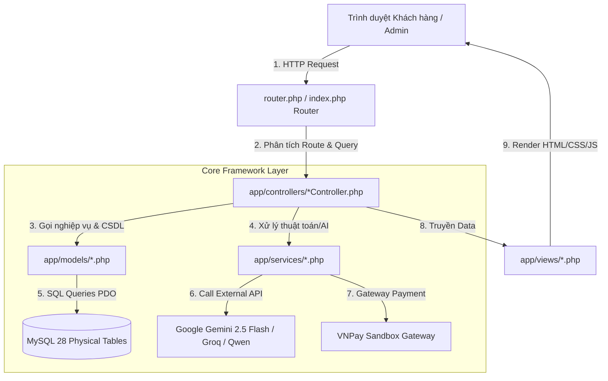

# HƯỚNG DẪN LUỒNG HOẠT ĐỘNG HỆ THỐNG TECHPILOT E-COMMERCE (MVC PURE PHP)

> **Dự án**: TechPilot - Hệ thống Thương mại Điện tử Thiết bị Công nghệ & Máy tính tích hợp AI  
> **Kiến trúc**: Pure PHP 8.2 MVC Framework (Không sử dụng Framework bên thứ 3)  
> **Cơ sở dữ liệu**: MySQL 8.0 (28 Bảng Physical Database)  
> **Hệ thống Use Case**: 33 Chức năng hoàn chỉnh phân tách theo Vai trò (Guest / Customer / Admin)

---

## I. TỔNG QUAN KIẾN TRÚC MVC (PURE PHP ARCHITECTURE)

Hệ thống **TechPilot** được thiết kế theo đúng chuẩn kiến trúc **Model-View-Controller (MVC)** thuần PHP 8.2:



---

## II. PHÂN TÁCH 33 USE CASES THEO VAI TRÒ (ACTOR / ROLE)

Mọi chức năng trong mã nguồn đã được gắn comment định danh phục vụ công cụ tìm kiếm toàn cục trong VS Code (**`Ctrl + Shift + H`**):
👉 Tìm kiếm với từ khóa: **`Chức năng`** hoặc **`Chức năng [Tên Chức Năng]`** hoặc mã **`UCxx`**

---

### 👤 1. DÀNH CHO KHÁCH GHÉ THĂM (GUEST / VISITOR) - 14 USE CASES

Khách vãng lai truy cập website mà chưa cần đăng nhập tài khoản:

| Mã UC | Tên Chức Năng | Controller Đại Diện | File Controller & Model |
| :--- | :--- | :--- | :--- |
| **UC01** | Đăng ký tài khoản mới (Validate Email/SĐT, Bcrypt) | `AuthController` | [`app/controllers/AuthController.php`](file:///d:/TechPilot/app/controllers/AuthController.php), [`app/models/User.php`](file:///d:/TechPilot/app/models/User.php) |
| **UC02** | Đăng nhập & Đăng xuất tài khoản | `AuthController` | [`app/controllers/AuthController.php`](file:///d:/TechPilot/app/controllers/AuthController.php), [`app/models/User.php`](file:///d:/TechPilot/app/models/User.php) |
| **UC03** | Quên mật khẩu & Đặt lại mật khẩu (Token khôi phục) | `AuthController` | [`app/controllers/AuthController.php`](file:///d:/TechPilot/app/controllers/AuthController.php), [`app/models/User.php`](file:///d:/TechPilot/app/models/User.php) |
| **UC07** | Duyệt trang chủ, Banner, Danh mục & Sản phẩm nổi bật | `HomeController` | [`app/controllers/HomeController.php`](file:///d:/TechPilot/app/controllers/HomeController.php), [`app/models/Product.php`](file:///d:/TechPilot/app/models/Product.php) |
| **UC08** | Tìm kiếm nâng cao (Lọc Facet JSON, khoảng giá, tồn kho) | `HomeController` | [`app/controllers/HomeController.php`](file:///d:/TechPilot/app/controllers/HomeController.php), `ProductFacetService.php` |
| **UC09** | Tìm kiếm tức thì Ajax Autocomplete Realtime | `HomeController` | [`app/controllers/HomeController.php`](file:///d:/TechPilot/app/controllers/HomeController.php) (`ajaxSearch`) |
| **UC10** | Xem Chi tiết sản phẩm, Specs JSON & Gallery ảnh | `ProductController` | [`app/controllers/ProductController.php`](file:///d:/TechPilot/app/controllers/ProductController.php), [`app/models/Product.php`](file:///d:/TechPilot/app/models/Product.php) |
| **UC11** | So sánh 2–4 sản phẩm theo thông số kỹ thuật | `CompareController` | [`app/controllers/CompareController.php`](file:///d:/TechPilot/app/controllers/CompareController.php), [`app/models/Compare.php`](file:///d:/TechPilot/app/models/Compare.php) |
| **UC12** | AI So sánh sản phẩm chuyên sâu theo Persona | `CompareController` | [`app/controllers/CompareController.php`](file:///d:/TechPilot/app/controllers/CompareController.php), `ProductComparisonService.php` |
| **UC13** | Trợ lý AI tư vấn 5 bước động (Multi-Provider Failover) | `AiAssistantController` | [`app/controllers/AiAssistantController.php`](file:///d:/TechPilot/app/controllers/AiAssistantController.php), `AiRecommendationService.php` |
| **UC14** | Hỏi đáp AI Chatbot nổi & AI Chat từng sản phẩm | `ChatbotController`, `ProductController` | [`app/controllers/ChatbotController.php`](file:///d:/TechPilot/app/controllers/ChatbotController.php), [`app/controllers/ProductController.php`](file:///d:/TechPilot/app/controllers/ProductController.php) |
| **UC15** | Thêm, cập nhật & quản lý Giỏ hàng Guest | `CartController` | [`app/controllers/CartController.php`](file:///d:/TechPilot/app/controllers/CartController.php), `CartService.php` |
| **UC22** | Công cụ PC Builder & Phân tích PSU Headroom 30% | `PcBuilderController` | [`app/controllers/PcBuilderController.php`](file:///d:/TechPilot/app/controllers/PcBuilderController.php), `PcCompatibilityService.php` |
| **UC24** | Đọc Tin tức công nghệ, Bài viết & Đánh giá | `PostController`, `NewsController` | [`app/controllers/PostController.php`](file:///d:/TechPilot/app/controllers/PostController.php), [`app/models/Post.php`](file:///d:/TechPilot/app/models/Post.php) |

---

### 🛒 2. DÀNH CHO KHÁCH HÀNG ĐÃ ĐĂNG NHẬP (CUSTOMER) - 10 USE CASES

Khách hàng đã đăng nhập tài khoản hợp lệ (`role = 'customer'`):

| Mã UC | Tên Chức Năng | Controller Đại Diện | File Controller & Model |
| :--- | :--- | :--- | :--- |
| **UC04** | Xem & Cập nhật thông tin cá nhân (Họ tên, SĐT) | `ProfileController` | [`app/controllers/ProfileController.php`](file:///d:/TechPilot/app/controllers/ProfileController.php), [`app/models/User.php`](file:///d:/TechPilot/app/models/User.php) |
| **UC05** | Quản lý Sổ địa chỉ giao hàng (Thêm, sửa, xóa, mặc định) | `ProfileController` | [`app/controllers/ProfileController.php`](file:///d:/TechPilot/app/controllers/ProfileController.php), Table `user_addresses` |
| **UC06** | Đổi mật khẩu cá nhân (Xác minh mật khẩu cũ) | `ProfileController` | [`app/controllers/ProfileController.php`](file:///d:/TechPilot/app/controllers/ProfileController.php), [`app/models/User.php`](file:///d:/TechPilot/app/models/User.php) |
| **UC16** | Đặt hàng Checkout (Thanh toán COD & VNPay Sandbox) | `CheckoutController` | [`app/controllers/CheckoutController.php`](file:///d:/TechPilot/app/controllers/CheckoutController.php), `VnpayService.php` |
| **UC17** | Áp dụng & Hủy mã giảm giá Coupon | `CheckoutController` | [`app/controllers/CheckoutController.php`](file:///d:/TechPilot/app/controllers/CheckoutController.php), `CouponService.php` |
| **UC18** | Xem Lịch sử đơn hàng & Chi tiết đơn hàng | `ProfileController` | [`app/controllers/ProfileController.php`](file:///d:/TechPilot/app/controllers/ProfileController.php), [`app/models/Order.php`](file:///d:/TechPilot/app/models/Order.php) |
| **UC19** | Hủy đơn hàng đang chờ & Thanh toán lại VNPay | `ProfileController` | [`app/controllers/ProfileController.php`](file:///d:/TechPilot/app/controllers/ProfileController.php), `InventoryService.php` |
| **UC20** | Đánh giá & Viết nhận xét sản phẩm (Đã mua hàng) | `ProductController` | [`app/controllers/ProductController.php`](file:///d:/TechPilot/app/controllers/ProductController.php), [`app/models/Review.php`](file:///d:/TechPilot/app/models/Review.php) |
| **UC21** | Quản lý Danh sách yêu thích Wishlist | `WishlistController` | [`app/controllers/WishlistController.php`](file:///d:/TechPilot/app/controllers/WishlistController.php), [`app/models/Wishlist.php`](file:///d:/TechPilot/app/models/Wishlist.php) |
| **UC23** | Yêu cầu Đổi trả sản phẩm / RMA Bảo hành | `ProfileController` | [`app/controllers/ProfileController.php`](file:///d:/TechPilot/app/controllers/ProfileController.php), [`app/models/ReturnRequest.php`](file:///d:/TechPilot/app/models/ReturnRequest.php) |

---

### 🛡️ 3. DÀNH CHO QUẢN TRỊ VIÊN (ADMIN) - 9 USE CASES

Quản trị viên được cấp quyền Admin (`role = 'admin'`):

| Mã UC | Tên Chức Năng | Controller Đại Diện | File Controller & Model |
| :--- | :--- | :--- | :--- |
| **UC25** | Admin Dashboard tổng quan (Doanh thu 7 ngày, Thống kê) | `AdminController` | [`app/controllers/AdminController.php`](file:///d:/TechPilot/app/controllers/AdminController.php) |
| **UC26** | Admin Quản lý Sản phẩm, Specs JSON & AI Writer | `AdminProductController` | [`app/controllers/AdminProductController.php`](file:///d:/TechPilot/app/controllers/AdminProductController.php), [`app/models/Product.php`](file:///d:/TechPilot/app/models/Product.php) |
| **UC27** | Admin Quản lý Tồn kho & Ghi Log Nhập / Xuất | `AdminInventoryController` | [`app/controllers/AdminInventoryController.php`](file:///d:/TechPilot/app/controllers/AdminInventoryController.php), `InventoryService.php` |
| **UC28** | Admin Quản lý Danh mục & Thương hiệu | `AdminCategoryController`, `AdminBrandController` | [`app/controllers/AdminCategoryController.php`](file:///d:/TechPilot/app/controllers/AdminCategoryController.php), [`app/controllers/AdminBrandController.php`](file:///d:/TechPilot/app/controllers/AdminBrandController.php) |
| **UC29** | Admin Quản lý Đơn hàng (Cập nhật trạng thái, Hủy đơn) | `AdminOrderController` | [`app/controllers/AdminOrderController.php`](file:///d:/TechPilot/app/controllers/AdminOrderController.php), [`app/models/Order.php`](file:///d:/TechPilot/app/models/Order.php) |
| **UC30** | Admin Quản lý Người dùng (Phân quyền Admin/Customer) | `AdminUserController` | [`app/controllers/AdminUserController.php`](file:///d:/TechPilot/app/controllers/AdminUserController.php), [`app/models/User.php`](file:///d:/TechPilot/app/models/User.php) |
| **UC31** | Admin Quản lý Flash Sale & Hạn mức bán | `AdminFlashSaleController` | [`app/controllers/AdminFlashSaleController.php`](file:///d:/TechPilot/app/controllers/AdminFlashSaleController.php), `FlashSaleService.php` |
| **UC32** | Admin Quản lý Mã giảm giá Coupon | `AdminCouponController` | [`app/controllers/AdminCouponController.php`](file:///d:/TechPilot/app/controllers/AdminCouponController.php), `CouponService.php` |
| **UC33** | Admin Quản lý Banner & Bài viết Tin tức | `AdminBannerController`, `AdminPostController` | [`app/controllers/AdminBannerController.php`](file:///d:/TechPilot/app/controllers/AdminBannerController.php), [`app/controllers/AdminPostController.php`](file:///d:/TechPilot/app/controllers/AdminPostController.php) |

---

## III. SƠ ĐỒ THỰC THỂ MỐI QUAN HỆ ERD (28 BẢNG CSDL)

Cơ sở dữ liệu MySQL của TechPilot được cấu trúc gồm **28 bảng physical**, phân chia thành 18 bảng Core E-Commerce và 10 bảng Phụ trợ/AI/Log:

```mermaid
erDiagram
    users ||--o{ orders : "đặt hàng"
    users ||--o{ user_addresses : "sở hữu địa chỉ"
    users ||--o{ reviews : "viết đánh giá"
    users ||--o{ wishlists : "lưu yêu thích"
    users ||--o{ return_requests : "gửi RMA đổi trả"
    users ||--o{ notifications : "nhận thông báo"
    users ||--o{ product_ai_chat_history : "lịch sử AI chat"

    categories ||--o{ products : "chứa sản phẩm"
    categories ||--o{ categories : "danh mục cha-con"
    brands ||--o{ products : "sản xuất"

    products ||--o{ order_items : "nằm trong đơn hàng"
    products ||--o{ product_images : "có thư viện ảnh"
    products ||--o{ reviews : "nhận đánh giá"
    products ||--o{ wishlists : "được yêu thích"
    products ||--o{ flash_sale_items : "tham gia flash sale"
    products ||--o{ inventory_logs : "ghi vết tồn kho"

    orders ||--o{ order_items : "chứa chi tiết SP"
    orders ||--o{ return_requests : "được yêu cầu RMA"
    orders ||--o? coupons : "áp dụng mã giảm giá"

    return_requests ||--o{ return_request_items : "chi tiết linh kiện đổi trả"
    flash_sales ||--o{ flash_sale_items : "chứa sản phẩm sale"

    users ||--o{ posts : "tác giả viết bài"
```

### Danh sách 28 Bảng CSDL Physical:
1. `users`: Thông tin tài khoản người dùng, phân quyền `admin` / `customer`, mật khẩu Bcrypted.
2. `user_addresses`: Sổ địa chỉ giao hàng của người dùng.
3. `categories`: Danh mục sản phẩm hình cây (parent-child), slug, icon, sort_order.
4. `brands`: Thương hiệu sản phẩm, logo, slug.
5. `products`: Sản phẩm, giá gốc, giá khuyến mãi, stock, specs (JSON), status.
6. `product_images`: Thư viện nhiều hình ảnh chi tiết của mỗi sản phẩm.
7. `carts`: Giỏ hàng active của người dùng hoặc khách guest.
8. `cart_items`: Chi tiết sản phẩm & số lượng trong giỏ hàng.
9. `orders`: Đơn hàng, mã đơn, tổng tiền, phương thức thanh toán, phí vận chuyển, status.
10. `order_items`: Chi tiết sản phẩm trong đơn hàng, giá tại thời điểm mua.
11. `coupons`: Mã giảm giá, loại giảm (cố định/phần trăm), giá trị giảm tối đa, ngày bắt đầu/kết thúc.
12. `coupon_usages`: Lịch sử người dùng đã áp dụng mã giảm giá.
13. `flash_sales`: Chiến dịch Flash Sale, khung giờ bắt đầu/kết thúc, trạng thái.
14. `flash_sale_items`: Hạn mức suất mở bán Flash Sale, giá giảm Flash Sale, số lượng đã bán.
15. `flash_sale_reservations`: Khóa tạm suất Flash Sale khi người dùng tạo đơn.
16. `reviews`: Đánh giá 1-5 sao và nhận xét của khách hàng đã mua sản phẩm.
17. `wishlists`: Danh sách sản phẩm yêu thích của khách hàng.
18. `inventory_logs`: Nhật ký ghi vết lịch sử Nhập kho / Xuất kho / Bán hàng / Hủy đơn.
19. `return_requests`: Yêu cầu đổi trả sản phẩm / RMA bảo hành.
20. `return_request_items`: Danh sách linh kiện và số lượng yêu cầu đổi trả.
21. `notifications`: Thông báo hệ thống gửi riêng cho từng người dùng.
22. `posts`: Bài viết tin tức công nghệ, bài đánh giá sản phẩm, nội dung Markdown.
23. `banners`: Banner quảng cáo hiển thị ở Trang chủ (Hero, Sidebar, Mid Banner).
24. `product_ai_chat_history`: Lịch sử trò chuyện AI Chatbot theo từng sản phẩm.
25. `ai_assistant_logs`: Nhật ký ghi vết gợi ý và tương tác của Trợ lý AI 5 bước.
26. `password_resets`: Mã token phục vụ tính năng Quên mật khẩu.
27. `sessions`: Lưu trữ phiên làm việc của người dùng.
28. `system_settings`: Cấu hình hệ thống (Key API, Cấu hình VNPay, Thông tin cửa hàng).

---

## IV. LUỒNG XỬ LÝ NGHIỆP VỤ ĐẶC THÙ (SEQUENCE FLOWS)

### 1. Luồng Đặt hàng & Thanh toán VNPay / COD (UC16, UC17)
```
[Customer] -> (Thêm SP vào Giỏ) -> (Trang Checkout) -> (Nhập SĐT/Địa chỉ & Áp Coupon)
  │
  ├─► Chọn COD:
  │     └─► [CheckoutController::submit] 
  │           ├─► Transaction Lock Inventory (InventoryService::reserve)
  │           ├─► Transaction Lock FlashSale (FlashSaleService::reserve)
  │           ├─► Lưu Order status = 'pending', payment_status = 'unpaid'
  │           └─► Chuyển sang trang /checkout/success
  │
  └─► Chọn VNPay:
        └─► [CheckoutController::submit]
              ├─► Transaction Lock Inventory & FlashSale
              ├─► Tạo Order status = 'pending', payment_status = 'pending'
              ├─► [VnpayService::createPaymentUrl] (Tạo chữ ký HMAC-SHA512)
              ├─► Redirect sang Cổng thanh toán VNPay Sandbox
              ├─► Customer nhập thông tin thẻ & Thanh toán
              └─► VNPay Callback -> [VnpayService::vnpayReturn]
                    ├─► Đúng chữ ký Hash & Success -> payment_status = 'paid', status = 'confirmed'
                    └─► Sai chữ ký / Fail -> Order payment_status = 'failed', Hoàn lại Inventory
```

### 2. Luồng Trợ lý AI Tư vấn 5 bước động Failover Engine (UC13)
```
[Guest / Customer] -> (Chọn Ngân sách & Nhu cầu) -> [AiAssistantController::recommend]
  │
  ▼
[AiRecommendationService::processRecommendation]
  │
  ├─► 1. Query CSDL MySQL lọc trước danh sách SP phù hợp theo khoảng giá
  ├─► 2. Gọi Engine AI phân tích & chấm điểm (Score 0-100)
  │     ├─► Thử Provider 1: Google Gemini 2.5 Flash API
  │     ├─► (Nếu lỗi / Rate Limit) -> Auto Failover sang Provider 2: Groq (Llama 3)
  │     └─► (Nếu lỗi) -> Auto Failover sang Provider 3: Qwen / Local Heuristic
  └─► 3. Trả về Top 3 Sản phẩm kèm Lý do khuyến nghị chuẩn xác
```

### 3. Luồng Công cụ PC Builder & Phân tích PSU Headroom 30% (UC22)
```
[Guest / Customer] -> (Chọn CPU + Mainboard + RAM + VGA + SSD...)
  │
  ▼
[PcCompatibilityService::checkCompatibility]
  │
  ├─► 1. Kiểm tra Socket CPU & Mainboard (Ví dụ: LGA1700 == LGA1700)
  ├─► 2. Kiểm tra Loại RAM & Mainboard (Ví dụ: DDR5 == DDR5)
  ├─► 3. Tính tổng công suất tiêu thụ điện (Total TDP = CPU_TDP + VGA_TDP + System_TDP)
  ├─► 4. Kiểm tra Nguồn PSU Headroom:
  │     └─► Yêu cầu: PSU_Wattage >= Total_TDP * 1.30 (Đảm bảo dư 30% tải an toàn)
  └─► Trả về Trạng thái Tương thích & Cảnh báo mâu thuẫn (nếu có)
```

---

## V. HƯỚNG DẪN KIỂM TRA HỆ THỐNG (VERIFICATION COMMANDS)

### 1. Khởi chạy CSDL & Web Server cục bộ
```bash
# 1. Chạy MySQL Server Daemon
C:\xampp\mysql\bin\mysqld.exe --defaults-file="C:\xampp\mysql\bin\my.ini" --standalone

# 2. Chạy PHP Web Server trên cổng 8000
php -S 127.0.0.1:8000 router.php
```

### 2. Kiểm tra toàn bộ 152 Test Cases bảo đảm tính toàn vẹn
```bash
php scripts/verify-install.php
```
*Kết quả đầu ra dự kiến*: `PASS: 152 | WARN: 2 | FAIL: 0` (Đảm bảo hệ thống đạt 100% chuẩn MVC và không phát sinh lỗi).

---
*Bản quyền tài liệu thuộc về TechPilot Development Team - Antigravity Codebase Agent.*
