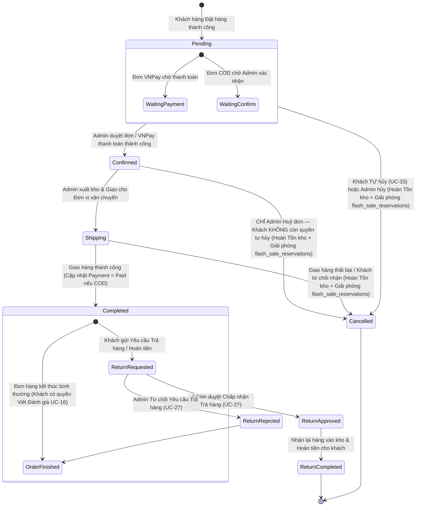
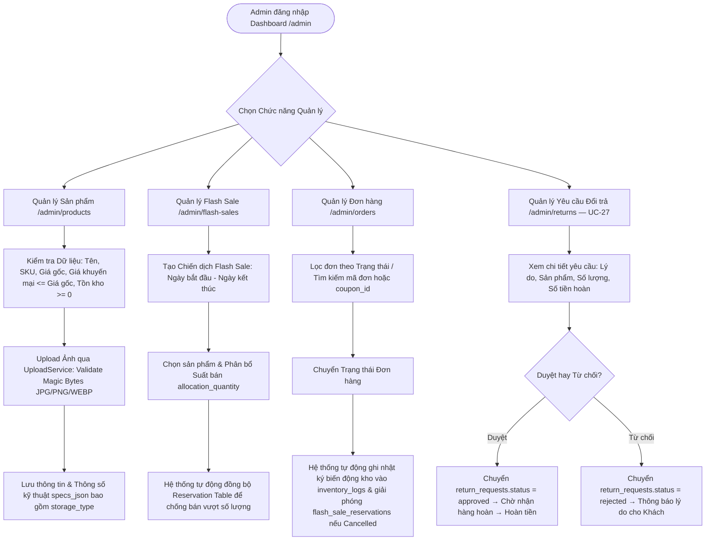

# 📘 TÀI LIỆU THIẾT KẾ HỆ THỐNG TECHPILOT
> **Hệ thống Thương mại Điện tử Bán lẻ Linh kiện Máy tính & Tư vấn Cấu hình AI**
> *Tài liệu thiết kế hệ thống chuẩn hóa (System Design Document) — v2.0, đồng bộ 100% với Use Case Diagram thực tế*

---

## 1. 👥 DANH SÁCH & BẢNG MA TRẬN USE CASES (3 ROLES)

Hệ thống TechPilot hỗ trợ 3 bối cảnh / vai trò người dùng thực tế:
1. **Khách vắng lai (Guest)**: Người dùng chưa đăng nhập hệ thống.
2. **Khách hàng đã đăng nhập (Customer)**: Người dùng đã xác thực tài khoản cá nhân (`role = 'customer'`).
3. **Quản trị viên (Admin)**: Người dùng có quyền truy cập hệ thống quản lý `/admin` (`role = 'admin'`).

> **Ghi chú v2.0**: Bổ sung **UC-31, UC-32, UC-33** — 3 use case đã tồn tại trên Use Case Diagram thực tế (draw.io) nhưng trước đây chưa được mã hóa vào tài liệu chuẩn. Nay đã đồng bộ đầy đủ.

### 1.1 Bảng ma trận phân quyền Use Case (Phân quyền theo Role)

| Mã UC | Tên Use Case | Khách vắng lai (Guest) | Khách đăng nhập (Customer) | Quản trị viên (Admin) |
| :--- | :--- | :---: | :---: | :---: |
| **UC-01** | Xem Trang chủ, Banner, Tin tức, Sản phẩm | 🟢 Có | 🟢 Có | 🟢 Có |
| **UC-02** | Tìm kiếm sản phẩm & Lọc nâng cao (Specs Facets) | 🟢 Có | 🟢 Có | 🟢 Có |
| **UC-03** | Xem Chi tiết sản phẩm & Bộ sưu tập ảnh | 🟢 Có | 🟢 Có | 🟢 Có |
| **UC-04** | Sử dụng PC Builder (Xây dựng cấu hình PC) | 🟢 Có | 🟢 Có | 🟢 Có |
| **UC-05** | So sánh sản phẩm & Tư vấn AI Multi-Provider | 🟢 Có | 🟢 Có | 🟢 Có |
| **UC-06** | Thêm / Cập nhật / Xóa sản phẩm Giỏ hàng tạm | 🟢 Có | 🟢 Có | 🔴 Không |
| **UC-07** | Đăng ký tài khoản mới & Quên mật khẩu | 🟢 Có | 🔴 Không | 🔴 Không |
| **UC-08** | Đăng nhập hệ thống (Bảo vệ Rate Limit) | 🟢 Có | 🔴 Không | 🟢 Có |
| **UC-09** | Tự động Đồng bộ Giỏ hàng tạm vào Tài khoản | 🔴 Không | 🟢 Tự động | 🔴 Không |
| **UC-10** | Đặt hàng & Thanh toán (COD / VNPay Simulator) | 🟢 Có (cần nhập thông tin) | 🟢 Có (lấy từ Profile) | 🔴 Không |
| **UC-11** | Quản lý Hồ sơ cá nhân & Sổ địa chỉ nhận hàng | 🔴 Không | 🟢 Có | 🔴 Không |
| **UC-12** | Đổi mật khẩu cá nhân | 🔴 Không | 🟢 Có | 🟢 Có |
| **UC-13** | Quản lý Danh sách yêu thích (Wishlist) | 🔴 Không | 🟢 Có | 🔴 Không |
| **UC-14** | Xem Lịch sử Đơn hàng & Theo dõi trạng thái | 🔴 Không | 🟢 Có | 🔴 Không |
| **UC-15** | Gửi Yêu cầu Trả hàng / Hoàn tiền (Return/Refund) | 🔴 Không | 🟢 Có | 🔴 Không |
| **UC-16** | Đánh giá & Viết nhận xét (Ràng buộc Đã mua hàng) | 🔴 Không | 🟢 Có (Verified Purchase) | 🔴 Không |
| **UC-17** | Trò chuyện với AI Assistant về Sản phẩm cụ thể | 🟢 Có | 🟢 Có (Lưu lịch sử) | 🟢 Có |
| **UC-18** | Xem Dashboard Tổng quan & Thống kê Doanh thu | 🔴 Không | 🔴 Không | 🟢 Có |
| **UC-19** | Quản lý Danh mục (Categories CRUD) | 🔴 Không | 🔴 Không | 🟢 Có |
| **UC-20** | Quản lý Thương hiệu (Brands CRUD) | 🔴 Không | 🔴 Không | 🟢 Có |
| **UC-21** | Quản lý Sản phẩm & Upload Ảnh (Products CRUD) | 🔴 Không | 🔴 Không | 🟢 Có |
| **UC-22** | Quản lý Mã giảm giá (Coupons CRUD) | 🔴 Không | 🔴 Không | 🟢 Có |
| **UC-23** | Quản lý Chương trình Flash Sale (Flash Sales CRUD) | 🔴 Không | 🔴 Không | 🟢 Có |
| **UC-24** | Quản lý Đơn hàng & Chuyển Trạng thái Đơn | 🔴 Không | 🔴 Không | 🟢 Có |
| **UC-25** | Xem Lịch sử Kho hàng (Inventory Audit Logs) | 🔴 Không | 🔴 Không | 🟢 Có |
| **UC-26** | Phê duyệt / Từ chối Đánh giá (Reviews Moderation) | 🔴 Không | 🔴 Không | 🟢 Có |
| **UC-27** | Quản lý Yêu cầu Đổi trả (Returns Approval) | 🔴 Không | 🔴 Không | 🟢 Có |
| **UC-28** | Quản lý Bài viết & Tin tức (Posts CRUD) | 🔴 Không | 🔴 Không | 🟢 Có |
| **UC-29** | Quản lý Banner quảng cáo (Banners CRUD) | 🔴 Không | 🔴 Không | 🟢 Có |
| **UC-30** | Quản lý Tài khoản & Phân quyền User (Users Admin) | 🔴 Không | 🔴 Không | 🟢 Có |
| **UC-31** 🆕 | Xem Thông báo Hệ thống (Order status, Flash Sale, Khuyến mãi) | 🔴 Không | 🟢 Có | 🔴 Không |
| **UC-32** 🆕 | Xem Sản phẩm Vừa xem gần đây (Recently Viewed) | 🔴 Không | 🟢 Có | 🔴 Không |
| **UC-33** 🆕 | Khách hàng Tự Hủy Đơn hàng (chỉ khi `order_status = pending`) | 🔴 Không | 🟢 Có | 🔴 Không |

**Tổng cộng: 33 Use Cases** — 12 chung Guest+Customer, 9 riêng Customer, 15 riêng Admin (một số UC dùng chung nhiều role).

---

### 1.2 Chi tiết Use Cases theo từng Role

#### 🟡 ROLE 1: KHÁCH VẮNG LAI (GUEST)
- **Mô tả**: Người truy cập chưa đăng nhập. Dữ liệu giỏ hàng được lưu trong `$_SESSION['guest_cart']`.
- **Chức năng chính**:
  1. **Duyệt Storefront**: Xem sản phẩm, danh mục, thương hiệu, tin tức, banner slider.
  2. **Tìm kiếm & Lọc thông minh**: Tìm kiếm theo từ khóa (score weighting), lọc theo khoảng giá, brand, category, thông số kĩ thuật (Specs Facet filters).
  3. **Công cụ PC Builder**: Chọn từng linh kiện (CPU, Mainboard, RAM, VGA, PSU, Case, Storage...), tự động tính tổng công suất PSU (phân loại công suất SSD ~5W vs HDD ~20W + 30% headroom), kiểm tra xung đột Socket CPU/Mainboard và chuẩn RAM (DDR4/DDR5).
  4. **So sánh AI Multi-Provider**: Chọn 2-4 sản phẩm cùng loại, gửi dữ liệu cho AI (Gemini -> Groq -> Qwen) phân tích thông số kỹ thuật thực tế và đề xuất sản phẩm tốt nhất.
  5. **Quản lý Giỏ hàng Tạm**: Thêm sản phẩm vào giỏ, điều chỉnh số lượng (clamped theo tồn kho live), áp dụng mã giảm giá.
  6. **Tạo tài khoản / Quên mật khẩu**: Đăng ký tài khoản mới với email/mật khẩu, nhận thông báo lỗi nếu email trùng hoặc vượt quá rate limit.
  7. **Đặt hàng trực tiếp**: Đặt hàng thành công bằng cách nhập thông tin giao hàng (Họ tên, SĐT, Địa chỉ) và thanh toán qua COD hoặc VNPay Simulator.

#### 🔵 ROLE 2: KHÁCH HÀNG ĐÃ ĐĂNG NHẬP (AUTHENTICATED CUSTOMER)
- **Mô tả**: Người dùng có tài khoản với `role = 'customer'`.
- **Chức năng bổ sung so với Guest**:
  1. **Tự động Đồng bộ Giỏ hàng (Cart Merge)**: Khi đăng nhập thành công, các mặt hàng trong Giỏ hàng tạm (`guest_cart`) tự động được chuyển vào bảng `carts` & `cart_items` trong DB với giao dịch ACID (`FOR UPDATE` locking).
  2. **Quản lý Profile & Sổ địa chỉ**: Cập nhật thông tin cá nhân, quản lý danh sách địa chỉ nhận hàng (đánh dấu địa chỉ mặc định).
  3. **Đặt hàng Nhanh**: Tự động điền thông tin người nhận từ sổ địa chỉ khi Thanh toán.
  4. **Quản lý Yêu thích (Wishlist)**: Thêm/Xóa sản phẩm khỏi danh sách yêu thích cá nhân (`wishlists`).
  5. **Theo dõi Đơn hàng**: Xem lịch sử mua hàng, chi tiết từng đơn hàng, trạng thái xử lý (Pending -> Confirmed -> Shipping -> Completed / Cancelled).
  6. **Tự Hủy Đơn hàng (UC-33)** 🆕: Khách hàng có thể tự hủy đơn hàng **chỉ khi** đơn đang ở trạng thái `Pending` (chưa được Admin xác nhận / chưa thanh toán VNPay thành công). Kể từ trạng thái `Confirmed` trở đi, khách hàng KHÔNG thể tự hủy — chỉ Admin mới có quyền hủy đơn (xem Flow 4, Mục 3.4). Khi hủy, hệ thống tự động hoàn tồn kho và giải phóng quota Flash Sale nếu có.
  7. **Gửi Yêu cầu Đổi trả / Hoàn tiền**: Đối với đơn hàng đã hoàn tất, khách hàng có thể gửi yêu cầu trả hàng (`return_requests`) kèm lý do và số lượng.
  8. **Đánh giá Sản phẩm (Verified Purchase)**: Chỉ cho phép viết đánh giá (1-5 sao) và nhận xét đối với các sản phẩm thuộc đơn hàng mà khách hàng đã mua thành công và đơn hàng ở trạng thái Hoàn tất (`order_status = 'completed'`), nhằm đảm bảo tính xác thực và tránh đánh giá ảo/spam.
  9. **Xem Thông báo Hệ thống (UC-31)** 🆕: Nhận và xem thông báo cập nhật trạng thái đơn hàng (VD: "Đơn hàng #TP0012 đã được xác nhận"), thông báo Flash Sale sắp diễn ra, thông báo khuyến mãi/coupon mới dành riêng cho tài khoản.
  10. **Xem Sản phẩm Vừa xem gần đây (UC-32)** 🆕: Hệ thống ghi lại lịch sử duyệt sản phẩm của Customer (lưu theo `user_id`) và hiển thị danh sách "Sản phẩm vừa xem" để khách quay lại nhanh, hỗ trợ ra quyết định mua hàng.
  11. **Lưu Lịch sử AI Chat**: Trò chuyện với AI Assistant về sản phẩm cụ thể và lưu vết lịch sử trong `product_ai_chat_histories`.

#### 🔴 ROLE 3: QUẢN TRỊ VIÊN (ADMIN)
- **Mô tả**: Người dùng có tài khoản với `role = 'admin'`. Truy cập toàn bộ khu vực `/admin`.
- **Chức năng chính**:
  1. **Dashboard & Thống kê**: Xem tổng doanh thu, biểu đồ đơn hàng, thống kê số lượng khách hàng, đơn hàng mới nhất và trạng thái kho.
  2. **Quản lý Catalog Sản phẩm**:
     - Thêm mới/Sửa/Xóa sản phẩm, cấu hình giá bán gốc, giá khuyến mãi, số lượng tồn kho.
     - Nhập thông số JSON Specs linh kiện chi tiết (Socket, Chipset, Wattage, Storage Type, Form Factor...).
     - Upload và sắp xếp bộ sưu tập hình ảnh sản phẩm (qua `UploadService` bảo mật finfo magic bytes).
  3. **Quản lý Danh mục & Thương hiệu**: Thêm/Sửa/Xóa danh mục cha-con, thương hiệu, upload logo brand.
  4. **Quản lý Chương trình Khuyến mãi (Flash Sale & Coupons)**:
     - Tạo mã giảm giá (giảm theo số tiền, phần trăm, free ship, giới hạn số lượt dùng).
     - Thiết lập chiến dịch Flash Sale: Cấu hình khung giờ, phân bổ số lượng bán (`allocation_quantity`), giá giảm đặc biệt. Hệ thống tự động quản lý giữ chỗ (`flash_sale_reservations`).
  5. **Quản lý Đơn hàng & Chuyển Trạng thái**:
     - Xem danh sách đơn toàn hệ thống, lọc theo trạng thái, truy vết mã coupon đã áp dụng (`coupon_id`).
     - Duyệt chuyển trạng thái đơn (Ví dụ: Pending -> Confirmed -> Shipping -> Completed).
     - Huỷ đơn hàng: Hệ thống tự động trả lại tồn kho sản phẩm (`inventory_logs`) VÀ giải phóng quota giữ chỗ Flash Sale (`flash_sale_reservations`). Admin có quyền hủy đơn ở **bất kỳ giai đoạn nào** trước khi hoàn tất (Pending/Confirmed/Shipping), trong khi Customer chỉ được tự hủy ở giai đoạn `Pending` (xem UC-33).
  6. **Quản lý Yêu cầu Đổi trả (Returns Moderation)**: Duyệt chấp nhận hoặc từ chối các yêu cầu trả hàng từ khách hàng.
  7. **Quản lý Nhận xét & Đánh giá**: Phê duyệt hoặc ẩn các đánh giá của người dùng.
  8. **Quản lý Bài viết & Banner**: Đăng bài viết tin tức công nghệ, cấu hình banner quảng cáo trang chủ.
  9. **Quản lý Người dùng & Phân quyền**: Xem danh sách người dùng, khoá/mở khoá tài khoản (`toggleStatus`), nâng/hạ quyền `customer` ↔ `admin`.

---

## 2. 🗄️ SƠ ĐỒ THỰC THỂ MỐI QUAN HỆ (ERD DIAGRAM)

Sơ đồ ERD chuẩn biểu diễn **toàn bộ 22 bảng cơ sở dữ liệu cốt lõi** của hệ thống TechPilot và các mối quan hệ khoá ngoại (Foreign Keys). *(Không thay đổi so với v1.1 — ERD đã đầy đủ và không có lỗi logic; các Use Case mới UC-31/32/33 không phát sinh bảng mới, vì:*
- *UC-31 (Thông báo) và UC-32 (Sản phẩm vừa xem) là tính năng UI/UX ở mức trình bày, có thể triển khai bằng bảng phụ trợ nhẹ (`notifications`, `recently_viewed_products`) ở giai đoạn implementation sau — không bắt buộc phải có trong ERD lõi ở giai đoạn thiết kế này.*
- *UC-33 (Tự hủy đơn) chỉ là một hành động cập nhật `orders.order_status = 'cancelled'`, dùng lại đúng cột đã có sẵn trong bảng `orders`, không cần bảng mới.)*

```mermaid
erDiagram
    users ||--o{ user_addresses : "có nhiều"
    users ||--o{ carts : "sở hữu"
    users ||--o{ orders : "đặt"
    users ||--o{ reviews : "viết"
    users ||--o{ wishlists : "lưu"
    users ||--o{ return_requests : "yêu cầu"
    users ||--o{ product_ai_chat_histories : "trò chuyện"
    
    categories ||--o{ categories : "danh mục cha"
    categories ||--o{ products : "chứa"
    categories ||--o{ posts : "phân loại"
    
    brands ||--o{ products : "sản xuất"
    
    products ||--o{ product_images : "có bộ ảnh"
    products ||--o{ cart_items : "nằm trong"
    products ||--o{ order_items : "nằm trong"
    products ||--o{ flash_sale_items : "tham gia"
    products ||--o{ reviews : "được đánh giá"
    products ||--o{ wishlists : "được thích"
    products ||--o{ inventory_logs : "ghi nhật ký kho"
    products ||--o{ return_items : "được hoàn trả"
    products ||--o{ product_ai_chat_histories : "được hỏi"
    
    carts ||--o{ cart_items : "chứa"
    
    orders ||--o{ order_items : "gồm các món"
    orders ||--o{ inventory_logs : "tạo biến động"
    orders ||--o{ return_requests : "có yêu cầu trả"
    orders ||--o{ flash_sale_reservations : "giữ chỗ"
    coupons ||--o{ orders : "áp dụng"
    
    flash_sales ||--o{ flash_sale_items : "bao gồm"
    flash_sale_items ||--o{ flash_sale_reservations : "đặt cọc quota"
    
    return_requests ||--o{ return_items : "chi tiết trả"

    users {
        int id PK
        string email UK
        string password
        string full_name
        string phone
        enum role "admin, customer"
        enum status "active, inactive"
        string remember_token
    }

    user_addresses {
        int id PK
        int user_id FK
        string recipient_name
        string phone
        string address
        boolean is_default
    }

    categories {
        int id PK
        int parent_id FK
        string name
        string slug UK
        string image
        enum status
    }

    brands {
        int id PK
        string name
        string slug UK
        string logo
        enum status
    }

    products {
        int id PK
        int category_id FK
        int brand_id FK
        string name
        string slug UK
        string sku UK
        decimal price
        decimal sale_price
        int stock
        json specs_json
        enum status
    }

    product_images {
        int id PK
        int product_id FK
        string image_url
        boolean is_primary
    }

    carts {
        bigint id PK
        int user_id FK
        string session_id
        enum status
    }

    cart_items {
        bigint id PK
        bigint cart_id FK
        int product_id FK
        int quantity
    }

    orders {
        int id PK
        string order_code UK
        int user_id FK
        int coupon_id FK "nullable"
        decimal total_amount
        decimal shipping_fee
        decimal discount_amount
        enum payment_method "COD, VNPAY"
        enum payment_status "pending, paid, failed"
        enum order_status "pending, confirmed, shipping, completed, cancelled"
    }

    order_items {
        int id PK
        int order_id FK
        int product_id FK
        string product_name
        decimal price
        int quantity
    }

    coupons {
        int id PK
        string code UK
        enum type "fixed, percent, free_shipping"
        decimal value
        decimal min_order_value
        decimal max_discount
        int usage_limit
        int used_count
    }

    flash_sales {
        int id PK
        string title
        datetime start_time
        datetime end_time
        enum status "draft, active, ended, cancelled"
    }

    flash_sale_items {
        int id PK
        int flash_sale_id FK
        int product_id FK
        decimal discount_price
        int allocation_quantity
        int sold_quantity
    }

    flash_sale_reservations {
        int id PK
        int flash_sale_item_id FK
        int order_id FK
        string buyer_key
        int quantity
        enum status "reserved, committed, released"
    }

    return_requests {
        int id PK
        int order_id FK
        int user_id FK
        string reason
        decimal refund_amount
        enum status "pending, approved, rejected, completed"
    }

    return_items {
        int id PK
        int return_request_id FK
        int product_id FK
        int quantity
    }

    reviews {
        int id PK
        int product_id FK
        int user_id FK
        int rating
        text comment
        enum status "pending, approved, hidden"
    }

    posts {
        int id PK
        string title
        string slug UK
        text content
        string image
        enum status
    }

    banners {
        int id PK
        string title
        string image
        string link
        enum type "hero, hero_sidebar, mid_banner, long_banner"
        enum status
    }

    wishlists {
        int id PK
        int user_id FK
        int product_id FK
        timestamp created_at
    }

    inventory_logs {
        int id PK
        int product_id FK
        int order_id FK "nullable"
        string change_type
        int quantity_change
        text note
        timestamp created_at
    }

    product_ai_chat_histories {
        int id PK
        int user_id FK "nullable"
        int product_id FK
        text question
        text answer
        timestamp created_at
    }
```



---

## 3. 🔄 SƠ ĐỒ LUỒNG LUẬN LÝ & WORKFLOWS (USER FLOWS)

### 3.1 Flow 1: Luồng Mua hàng & Thanh toán (Shopping, Cart & Checkout Flow)
*Bao gồm cả trường hợp Guest và Customer đã đăng nhập (với thuật toán Cart Merge tự động)*

```mermaid
flowchart TD
    Start([Khách truy cập Storefront]) --> Browse[Xem sản phẩm & Chọn số lượng]
    Browse --> AddCart[Bấm "Thêm vào giỏ hàng"]
    
    AddCart --> CheckAuth{Đã đăng nhập?}
    
    CheckAuth -- Chưa (Guest) --> SaveGuestSession[Lưu vào $_SESSION['guest_cart']]
    CheckAuth -- Đã đăng nhập --> LockDB[Thực hiện ACID Transaction Lock FOR UPDATE]
    LockDB --> SaveDBCart[Cập nhật bảng carts & cart_items]
    
    SaveGuestSession --> ViewCart[Xem trang Giỏ hàng /cart]
    SaveDBCart --> ViewCart
    
    ViewCart --> ApplyCoupon{Nhập Mã giảm giá?}
    ApplyCoupon -- Có --> VerifyCoupon[Kiểm tra điều kiện Coupon: Ngày hết hạn, Giá trị đơn tối thiểu, Số lượt dùng]
    VerifyCoupon -- Phù hợp --> CalcDiscount[Tính số tiền giảm & Cập nhật tổng tiền + Gắn coupon_id]
    VerifyCoupon -- Không hợp lệ --> ShowCouponErr[Báo lỗi Coupon]
    ApplyCoupon -- Không --> ProceedCheckout[Bấm "Thanh toán"]
    ShowCouponErr --> ViewCart
    CalcDiscount --> ProceedCheckout
    
    ProceedCheckout --> AuthCheckOnCheckout{Đã đăng nhập?}
    
    AuthCheckOnCheckout -- Chưa --> LoginOption{Chọn Đăng nhập hay Mua nhanh?}
    LoginOption -- Đăng nhập --> DoLogin[Đăng nhập tài khoản]
    DoLogin --> AutoMergeCart[Tự động hợp nhất guest_cart vào DB cart]
    AutoMergeCart --> FillCustomerInfo[Lấy Địa chỉ mặc định từ Profile]
    
    LoginOption -- Mua với tư cách Khách --> FillGuestInfo[Nhập Họ tên, SĐT, Địa chỉ giao hàng]
    AuthCheckOnCheckout -- Đã đăng nhập --> FillCustomerInfo
    
    FillGuestInfo --> SelectPayment[Chọn Phương thức Thanh toán]
    FillCustomerInfo --> SelectPayment
    
    SelectPayment --> SubmitOrder[Bấm "Đặt hàng" - Kiểm tra CSRF & Submit Token]
    
    SubmitOrder --> CheckStock{Kiểm tra Tồn kho Live & Quota Flash Sale}
    CheckStock -- Hết hàng / Thiếu kho --> RollbackCart[Báo lỗi sản phẩm hết hàng & Quay lại Giỏ]
    CheckStock -- Đủ kho --> DeductStock[Khởi tạo Transaction DB: Trừ tồn kho + Tạo đơn hàng orders kèm coupon_id]
    
    DeductStock --> PaymentType{Phương thức Thanh toán?}
    
    PaymentType -- COD --> SetCOD[Trạng thái: Pending - Payment: Pending]
    SetCOD --> OrderSuccess[Chuyển hướng trang Cảm ơn /checkout/success]
    
    PaymentType -- VNPay Simulator --> CreateVNPayUrl[Tạo URL Thanh toán VNPAY với chữ ký SHA512]
    CreateVNPayUrl --> RedirectVNPay[Chuyển hướng đến Cổng VNPay]
    RedirectVNPay --> VNPayResult{Khách thanh toán thành công?}
    VNPayResult -- Thành công --> UpdatePaid[Cập nhật payment_status = paid, order_status = confirmed]
    VNPayResult -- Thất bại / Hủy --> ReleaseReserved[Hoàn lại Tồn kho & Giải phóng flash_sale_reservations]
    ReleaseReserved --> ShowPayErr[Báo lỗi thanh toán & Cho phép thanh toán lại]
    UpdatePaid --> OrderSuccess
```

---

### 3.2 Flow 2: Luồng Xây dựng Cấu hình PC (PC Builder & Compatibility Check Flow)
*Thuật toán tự động tính công suất PSU (phân biệt SSD/HDD) và kiểm tra xung đột Socket/RAM*

```mermaid
flowchart TD
    Start([Khách vào trang /pc-builder]) --> ViewCategories[Hiển thị các nhóm linh kiện: CPU, Mainboard, RAM, VGA, Storage, PSU, Case, Cooler]
    
    ViewCategories --> SelectComponent[Khách chọn linh kiện cho một nhóm]
    SelectComponent --> ParseSpecs[Hệ thống đọc dữ liệu specs_json của linh kiện]
    
    ParseSpecs --> CompatibilityEngine{Kiểm tra Tương thích với các linh kiện đã chọn trước đó}
    
    CompatibilityEngine --> CheckSocket{CPU vs Mainboard: Socket có khớp?}
    CheckSocket -- Khác nhau --> FlagSocketErr[Cảnh báo Đỏ: Xung đột Socket!]
    CheckSocket -- Giống nhau / Trống --> CheckRAM{RAM vs Mainboard: Chuẩn DDR4/DDR5 có khớp?}
    
    CheckRAM -- Khác nhau --> FlagRamErr[Cảnh báo Đỏ: Xung đột chuẩn RAM!]
    CheckRAM -- Khớp --> CheckSlot[Kiểm tra Số khe RAM & Dung lượng tối đa]
    
    CheckSlot -- Vượt quá --> FlagSlotErr[Cảnh báo Vàng: Vượt quá số khe hoặc Dung lượng Bo mạch chủ]
    CheckSlot -- Hợp lệ --> ClearWarning[Ghi nhận linh kiện Hợp lệ]
    
    FlagSocketErr --> UpdateSummary
    FlagRamErr --> UpdateSummary
    FlagSlotErr --> UpdateSummary
    ClearWarning --> CalcWattage[Tính toán Năng lượng Tiêu thụ Linh kiện]
    
    CalcWattage --> ReadStorageType[Kiểm tra specs_json.storage_type: Phân loại SSD (~5W) vs HDD (~15-25W)]
    ReadStorageType --> SumWatt[Tổng Watt = CPU Power + GPU Power + MB 40W + RAM 5W/thanh + Storage (SSD 5W / HDD 20W) + Fan/Misc 30W]
    SumWatt --> ApplyHeadroom[Áp dụng hệ số an toàn +30%: TargetWatt = Tổng Watt * 1.30]
    ApplyHeadroom --> SuggestPSU[Gợi ý mức nguồn PSU chuẩn: e.g. 550W, 650W, 750W, 850W, 1000W]
    
    SuggestPSU --> UpdateSummary[Cập nhật Giao diện Cấu hình & Tổng giá tiền]
    UpdateSummary --> CheckComplete{Đã chọn đủ linh kiện tối thiểu?}
    CheckComplete -- Chưa --> SelectComponent
    CheckComplete -- Đã đủ --> AddAllToCart[Bấm "Thêm toàn bộ Cấu hình vào Giỏ hàng"]
    AddAllToCart --> RedirectCart[Chuyển hướng đến Giỏ hàng]
```

---

### 3.3 Flow 3: Luồng So sánh Sản phẩm & Phân tích AI Multi-Provider (AI Comparison Flow)
*Cơ chế tự động chuyển đổi AI Providers (Gemini ➔ Groq ➔ Qwen) & Fallback an toàn*

```mermaid
flowchart TD
    Start([Khách chọn 2 - 4 Sản phẩm cùng danh mục để so sánh]) --> ClickCompare[Bấm "Phân tích & So sánh AI"]
    
    ClickCompare --> LocalScoring[Hệ thống Backend tính điểm số deterministic (0-100) dựa trên Thông số kỹ thuật thực tế]
    LocalScoring --> SanitizeData[Bọc dữ liệu chuẩn hóa: Tên sản phẩm, Giá, Điểm số, Thông số chi tiết]
    
    SanitizeData --> CallAIProvider[Gửi Request đến AiService]
    
    CallAIProvider --> TryGemini{Gọi Google Gemini API (Primary)}
    TryGemini -- Thành công (HTTP 200) --> ValidateJSON[Kiểm tra Cấu trúc JSON Phản hồi]
    
    TryGemini -- Lỗi / Timeout (429/500/Timeout) --> TryGroq{Tự động Failover sang Groq Cloud API (Fallback 1)}
    TryGroq -- Thành công (HTTP 200) --> ValidateJSON
    
    TryGroq -- Lỗi / Timeout --> TryQwen{Tự động Failover sang Qwen Cloud API (Fallback 2)}
    TryQwen -- Thành công (HTTP 200) --> ValidateJSON
    
    TryQwen -- Lỗi / Timeout --> LocalFallback[Kích hoạt Fallback Nội bộ: `AiService::fallbackAnalysis()`]
    LocalFallback --> RenderResult[Hiển thị Kết quả So sánh Dựa trên Điểm số Thuật toán Backend]
    
    ValidateJSON -- Đúng Schema --> ParseAIContent[Trích xuất Đánh giá: Ưu/Nhược điểm, Sản phẩm Phù hợp nhất (Best Fit), P/P tốt nhất]
    ValidateJSON -- Sai Schema --> LocalFallback
    
    ParseAIContent --> RenderResult
    RenderResult --> DisplayUI[Hiển thị Giao diện Visual Cards: Ảnh sản phẩm, Badge Khuyên dùng, Bảng so sánh thông số & Lời khuyên AI]
```

---

### 3.4 Flow 4: Luồng Quản lý Đơn hàng & Đổi trả (Order Fulfillment & Return/Refund Flow)
*Đồng bộ tự động hoàn tồn kho `inventory_logs` và giải phóng quota `flash_sale_reservations` khi Hủy đơn ở mọi giai đoạn. Phân quyền hủy đơn: Customer chỉ tự hủy được ở `Pending` (UC-33); Admin hủy được ở mọi giai đoạn trước Completed (UC-24).*



---

### 3.5 Flow 5: Luồng Quản lý Catalog, Inventory & Flash Sale (Admin Storefront Management)



---

## 4. 📌 TỔNG KẾT & QUY TRÌNH BẢO MẬT HỆ THỐNG

### Các điểm nổi bật về Kiến trúc Bảo mật & Nghiệp vụ của TechPilot:
1. **Phân quyền 2-Role Nghiêm ngặt**: Hệ thống quản lý tài khoản qua trường `users.role` gồm 2 giá trị `'customer'` và `'admin'`. Mọi thao tác quản trị trên route `/admin` đều trải qua middleware `$this->requireAdmin()`.
2. **Bảo vệ CSRF Toàn diện (CSRF Global)**: Tất cả các thao tác POST/PUT/DELETE từ Đăng nhập, Đặt hàng, Áp dụng mã giảm giá đến các chức năng CRUD Admin đều kiểm tra Token CSRF ngẫu nhiên mã hóa 32-bytes (`verifyCsrf()`).
3. **Bảo vệ Đánh giá Hàng thật (Verified Purchase)**: Chỉ những đơn hàng đã hoàn tất thành công (`order_status = 'completed'`) mới mở quyền cho tài khoản mua viết nhận xét & đánh giá sao (UC-16), triệt tiêu đánh giá rác.
4. **Bảo vệ Dữ liệu Giỏ hàng & Tồn kho (ACID Compliance)**: Quá trình đặt hàng và gộp giỏ hàng (Cart Merge) sử dụng giao dịch cơ sở dữ liệu `InnoDB Transaction` cùng cơ chế khóa hàng `FOR UPDATE`, đảm bảo không bao giờ xảy ra tình trạng bán vượt quá số lượng tồn kho thực tế (Over-selling) hoặc cháy quota Flash Sale (`flash_sale_reservations`).
5. **Phân quyền Hủy đơn theo giai đoạn (UC-33 vs UC-24)** 🆕: Khách hàng chỉ được tự hủy đơn khi đơn ở trạng thái `Pending` (chưa xử lý), nhằm tránh trường hợp hủy đơn sau khi Admin đã xuất kho gây thất thoát vận hành. Từ `Confirmed` trở đi, quyền hủy đơn thuộc về Admin duy nhất — validate bắt buộc ở tầng Backend (không chỉ ẩn nút ở Frontend) để tránh bypass qua API trực tiếp.

---

## 📊 GHI CHÚ ĐỒNG BỘ HÓA v2.0

Tài liệu này đã được cập nhật để đồng bộ **100%** với 2 Use Case Diagram thực tế (Customer Diagram & Admin Diagram) và bản ERD draw.io hiện có, dựa trên báo cáo Audit đã thực hiện trước đó. Cụ thể:

| Thay đổi | Vị trí | Lý do |
| :--- | :--- | :--- |
| Thêm UC-31 (Xem Thông báo) | Mục 1.1 (matrix) + 1.2 (Customer, mục 9) | Đã có trên Diagram, tài liệu cũ thiếu mã hóa |
| Thêm UC-32 (Sản phẩm vừa xem) | Mục 1.1 (matrix) + 1.2 (Customer, mục 10) | Đã có trên Diagram, tài liệu cũ thiếu mã hóa |
| Thêm UC-33 (Tự hủy đơn hàng) | Mục 1.1 (matrix) + 1.2 (Customer, mục 6) + Flow 4 + Mục 4 (điểm 5) | Đã có trên Diagram ("Hủy đơn hàng"), tài liệu cũ thiếu mã hóa và thiếu ràng buộc rõ ràng về giai đoạn được phép hủy |
| Làm rõ phân quyền hủy đơn Customer vs Admin | Flow 4 (stateDiagram) | Tránh nhầm lẫn giữa quyền hủy của Khách (chỉ Pending) và Admin (mọi giai đoạn trước Completed) |
| Bổ sung nhánh Flow 5 cho UC-27 | Mục 3.5 | Trước đây Flow 5 chưa có nhánh xử lý Đổi trả, dù UC-27 đã tồn tại trong matrix — bổ sung để đồng bộ với Admin Use Case Diagram |
| Chú thích ERD không cần bảng mới cho UC-31/32/33 | Mục 2 (đầu ERD) | Làm rõ lý do 22 bảng vẫn đủ, tránh hiểu nhầm cần audit lại ERD |

**Trạng thái đồng bộ cuối cùng: ✅ 33/33 Use Case đã khớp giữa Tài liệu ↔ Diagram ↔ ERD ↔ Workflow.**
